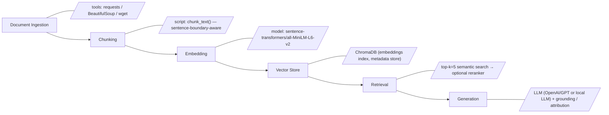

# Project 1 Planning: The Unofficial Guide

> Write this document before you write any pipeline code.
> Your spec and architecture diagram are what you'll use to direct AI tools (Claude, Copilot, etc.) to generate your implementation — the more specific they are, the more useful the generated code will be.
> Update the Retrieval Approach and Chunking Strategy sections if you change your approach during implementation.
> Update this file before starting any stretch features.

---

## Domain

Course and professor reviews (general): student-generated descriptions of teaching style, workload, grading, and exam difficulty across many institutions. This knowledge complements official syllabi by capturing lived experience (e.g., how instructors grade, which assignments are time-consuming, common exam traps) that is rarely summarized in course catalogs.

These insights are scattered across syllabi, forum threads, RateMyProfessors pages, and public course repositories, making them hard to aggregate or search; the Unofficial Guide will collect and structure these sources so users can retrieve practical, experience-based advice quickly.

---

## Documents

| # | Source | Description | URL or location |
|---|--------|-------------|-----------------|
| 1 | CS107 (Stanford) course page | Course announcements, syllabus, assignments | https://web.stanford.edu/class/cs107/ |
| 2 | MIT OCW — 6.006 (Algorithms) | Syllabus, lecture notes, problem sets | https://ocw.mit.edu/courses/6-006-introduction-to-algorithms-spring-2020/ |
| 3 | MIT OCW — 6.0001 (Intro to CS, Python) | Syllabus, instructor insights, assignments | https://ocw.mit.edu/courses/6-0001-introduction-to-computer-science-and-programming-in-python-fall-2016/ |
| 4 | Harvard CS50 syllabus | Detailed expectations, problem sets, policies | https://cs50.harvard.edu/x/2023/syllabus/ |
| 5 | Open Syllabus Project | Aggregated syllabi dataset and analytics | https://opensyllabus.org/ |
| 6 | GitHub — public syllabi repos search | Many public course repos (syllabi, notes) | https://github.com/search?q=syllabus+university&type=repositories |
| 7 | RateMyProfessors (search) | Student reviews of instructors (multiple pages) | https://www.ratemyprofessors.com/search/teachers?query=computer%20science |
| 8 | Reddit r/college (threads) | Student threads about best/worst professors | https://www.reddit.com/r/college/search?q=best%20professors&restrict_sr=1&type=link |
| 9 | Quora — professor recommendation threads | Crowdsourced recommendations and experiences | https://www.quora.com/Which-are-the-best-professors-in-your-college |
| 10 | The Student Room — discussion threads | UK student forum threads about professors | https://www.thestudentroom.co.uk/search.php?search_terms=professors |
| 11 | College Confidential — forums | US college discussion threads about instructors | https://www.collegeconfidential.com/search/?q=professor+reviews |
| 12 | Public course repositories on GitHub (examples) | Individual syllabi, lecture notes, and course materials | (see multiple repos from GitHub search results) |

---

## Chunking Strategy

<!-- How will you split documents into chunks?
     State your chunk size (in tokens or characters), overlap size, and explain why those
     numbers fit the structure of your documents.
     A review-heavy corpus warrants different chunking than a long FAQ. -->

**Chunk size:**
Primary: 1,000 tokens (roughly 6–8k characters) for long, structured documents (syllabi, course hubs, long README files).

Secondary (short-review mode): 300 tokens (roughly 1.5–2k characters) for short reviews, forum posts, and single-page professor comments that are naturally brief.

When a document is shorter than the secondary threshold, keep it as a single chunk.

**Overlap:**
Primary overlap: 200 tokens (~1.2–1.6k characters).

Secondary overlap: 50 tokens (~250–350 characters) for short-review mode.

**Reasoning:**
1. Mixed-length corpus: sources include long, structured pages (OCW syllabi, course hubs, GitHub README/syllabus files) and many short, informal items (RateMyProfessors snippets, Reddit posts). A two-tier chunking approach preserves coherence for long documents while avoiding unnecessary fragmentation of short reviews.

2. Chunk sizes chosen to keep multiple related sentences and a small paragraph in each chunk so retrieval returns semantically complete context (not single sentences). The 200-token overlap for long docs prevents splitting key facts (e.g., grading policy sentence split across chunks) and improves retrieval recall when queries reference transitional sentences.

3. Preprocessing rules before chunking:
     - Strip navigation, footer, and boilerplate HTML (site menus, trackers, repeated header/footer blocks).
     - Collapse consecutive whitespace and normalize newlines.
     - Preserve sentence boundaries: split chunks at the last full sentence under the size threshold rather than cutting mid-sentence.
     - Normalize author/date metadata into a short header for each chunk (source URL, document title, date if available) so retrieved chunks carry attribution.
     - For GitHub repos, prefer `README.md` / `syllabus.md` / top-level docs as primary inputs; ignore incidental code files.

4. Chunk labeling: each chunk will include a small metadata header (source id, chunk index, character range) to make browsing and attribution straightforward during generation.

**Estimated final chunk count:** With the 12 selected sources (mix of long course hubs and many short reviews/repos) I expect roughly 250–400 chunks total; plan for ~300 chunks as a working estimate and adjust after initial ingestion.

**Guidance & diagnostics (how to change this strategy):**

- Documents type impact: if the corpus shifts toward mostly short reviews (1–3 sentences) move entirely to the Secondary mode (300-token chunk size) or even smaller per-document chunks (one review = one chunk). If the corpus is dominated by long guides, keep Primary at ~1,000 tokens and consider increasing overlap to 300 tokens for narrative-heavy pages.

- Overlap tradeoff: overlap helps when key facts sit near chunk boundaries. If queries return partial facts (e.g., "grading is" in one chunk and "lenient" in the next), increase overlap (Primary +50–100 tokens). If overlap causes redundant retrievals and inflates storage/cost without improving answers, reduce overlap.

- How to detect bad chunking:
     - Too small: retrieval returns many tiny chunks with isolated sentences; generated answers lack context or contradict themselves because supporting sentences were split across chunks. Symptoms: low answer coherence, frequent "I don't know" or hallucinated filler, high number of retrieved chunks per query.
     - Too large: retrieved chunks contain multiple unrelated sections (e.g., syllabus + assignment details + staff contacts), causing noisy or off-topic answers and higher embedding/indexing cost. Symptoms: low precision (irrelevant text included), slow retrieval, and generation that mixes unrelated facts.

- Tuning approach: run a small validation set of 10 representative queries (course selection, grading policy, workload) and inspect top-5 retrieved chunks for relevance and completeness. If >30% of queries miss an expected fact, adjust chunk size/overlap and re-run. Track chunk count and average chunk length after preprocessing to ensure the corpus matches expected estimates.

- Practical rule of thumb: prefer slightly larger chunks with moderate overlap for syllabus-style sources (better recall), and single-chunk-per-document for short-review sources (better precision and cost efficiency).
---

## Retrieval Approach

<!-- Which embedding model are you using (e.g., all-MiniLM-L6-v2 via sentence-transformers)?
     How many chunks will you retrieve per query (top-k)?
     If you were deploying this for real users and cost wasn't a constraint, what tradeoffs
     would you weigh in choosing a different embedding model — context length, multilingual
     support, accuracy on domain-specific text, latency? -->

**Embedding model:**

`sentence-transformers/all-MiniLM-L6-v2`

This model is a good fit because the corpus mixes formal syllabus language with informal student commentary, and we want a fast local baseline that still captures meaning across different writing styles.

**Top-k:**

5 retrieved chunks per query, with reranking if available.

Retrieving too few chunks risks missing the one fact the answer depends on, especially when the relevant detail appears in a different source or a neighboring chunk. Retrieving too many chunks adds noise, makes the prompt less focused, and can push the model toward generic or contradictory answers even when the right fact is present.

**Production tradeoff reflection:**

Semantic search works because embeddings place texts with similar meaning close together in vector space, even when they do not share exact words. That lets a query like "is this class hard" surface chunks that say "heavy workload," "time-consuming assignments," or "challenging exams" without requiring literal word overlap.

If cost were not a constraint, I would compare a higher-accuracy embedding model with better long-text handling and stronger domain nuance against latency, storage, and indexing cost. For this project, the main tradeoff is recall versus simplicity: I am prioritizing a lightweight model that is easy to run locally and iterate on, while keeping enough semantic quality for practical course-review search.

---

## Evaluation Plan

<!-- List your 5 test questions with their expected correct answers.
     Questions should be specific enough that you can judge whether the system's response
     is right or wrong. "What are good dining halls?" is too vague.
     "What do students say about wait times at [dining hall name] during lunch?" is testable. -->

| # | Question | Expected answer |
|---|----------|-----------------|
| 1 | According to the CS50 syllabus, how many problem sets must students submit? | Ten problem sets. |
| 2 | Where does Stanford CS107 instruct students to check for important course announcements? | On the course web page and the Ed Discussion forum (and announced in class). |
| 3 | According to MIT 6.0001's course description, who is the course intended for? | Students with little or no programming experience. |
| 4 | Which learning resource types are listed on the MIT 6.006 course page? | Lecture notes, lecture videos, problem sets, quizzes, and exam/solution materials. |
| 5 | Open Syllabus claims to map the college curriculum across how many syllabi? | 32.9 million syllabi. |

---

## Anticipated Challenges

<!-- What could go wrong? Name at least two specific risks with reasoning.
     Consider: noisy or inconsistent documents, missing source attribution, off-topic
     retrieval, chunks that split key information across boundaries. -->

1. Noisy or inconsistent documents: forum posts and RateMyProfessors entries are informal, abbreviated, and vary widely in quality. This increases false positives during retrieval and can surface anecdotal or unrepresentative claims.
     - Mitigation: prioritize higher-quality sources (official syllabi, well-maintained course pages, README files) when building the initial index; apply simple quality filters (minimum length, presence of structured fields) and surface low-confidence sources with explicit disclaimers during generation.

2. Missing or ambiguous source attribution: many short reviews lack dates, exact course identifiers, or author context, making it hard to verify whether a comment applies to the correct semester or instructor.
     - Mitigation: normalize and attach available metadata (URL, scraped date, document title) to each chunk; when metadata is missing, mark chunks as "unknown origin" and avoid presenting them as definitive — require multiple supporting chunks before asserting instructor-level claims.

3. Chunks splitting key facts across boundaries: if grading policies or workload notes are cut mid-sentence, retrieval may return incomplete facts that mislead the generator.
     - Mitigation: use sentence-boundary-aware splitting with overlap (already set in Chunking Strategy). During validation, check retrievals for truncated sentences and increase overlap for sources that frequently exhibit this issue.

4. Off-topic retrieval and topical drift: GitHub repos and course hubs include unrelated sections (e.g., recruitment, research info) that can be retrieved for irrelevant queries, lowering precision.
     - Mitigation: apply simple heuristics to prioritize sections (syllabus, README, assignments) and use a reranker or lightweight classifier to prefer chunks that match the query's intent (e.g., "grading" queries should prefer chunks mentioning grades/assessment).

5. Outdated or biased information: public reviews may reflect past instructors or fail to note curricular changes.
     - Mitigation: preserve and present dates where available, and prefer recent sources for time-sensitive queries; when conflicting sources exist, surface both and label uncertainty rather than pick a single authoritative statement.

---

## Architecture

<!-- Draw a diagram of your pipeline showing the five stages:
     Document Ingestion → Chunking → Embedding + Vector Store → Retrieval → Generation
     Label each stage with the tool or library you're using.
     You can use ASCII art, a Mermaid diagram, or embed a sketch as an image.
     You'll use this diagram as context when prompting AI tools to implement each stage. -->

Description: Ingestion pulls pages/files; chunking creates sentence-aware chunks with metadata; embedding converts chunks via `all-MiniLM-L6-v2`; ChromaDB stores vectors and metadata; retrieval performs top-k semantic search (reranked if available); generation composes grounded answers with source attribution.
---

## AI Tool Plan

<!-- For each part of the pipeline below, describe:
     - Which AI tool you plan to use (Claude, Copilot, ChatGPT, etc.)
     - What you'll give it as input (which sections of this planning.md, which requirements)
     - What you expect it to produce
     - How you'll verify the output matches your spec

     "I'll use AI to help me code" is not a plan.
     "I'll give Claude my Chunking Strategy section and ask it to implement chunk_text()
     with my specified chunk size and overlap" is a plan. -->

**Milestone 3 — Ingestion and chunking:**

- *AI tool:* GitHub Copilot / ChatGPT / Claude (Claude Code) (code generation) plus local Python scripts.
- *Input to AI:* `Chunking Strategy` section, list of source URLs, examples of long and short source HTML/plaintext, and desired chunk/overlap sizes.
- *Expected output:* a set of reproducible scripts: `ingest.py` (download and normalize pages), `clean_html()` (strip boilerplate), and `chunk_text()` implementing sentence-boundary-aware splitting with the two-tier size policy; each chunk saved with metadata (source, date, chunk index, char range) and unit tests that assert no chunk exceeds token limits and that sentence boundaries are preserved.
- *How to verify:* run unit tests on a small sample of sources; check that (a) average chunk length matches expected thresholds, (b) no chunks start/end mid-sentence, and (c) metadata is present for every chunk. Include a small `examples/` folder with 3 long and 3 short documents to validate behavior.

**Milestone 4 — Embedding and retrieval:**

- *AI tool:* ChatGPT / Copilot / Claude (Claude Code) for orchestration code; use `sentence-transformers` library for embeddings and `ChromaDB` (or local alternative) as the vector store.
- *Input to AI:* sample chunk files, `all-MiniLM-L6-v2` model choice, `Top-k` decision from Retrieval Approach, and expected metadata fields.
- *Expected output:* `embed.py` that loads chunks, produces embeddings with `all-MiniLM-L6-v2`, and writes vectors + metadata to Chroma; a retrieval helper `search(query, k=5)` that returns top-k chunks and their metadata; optional reranker script to reorder results by simple lexical match or a learned scorer.
- *How to verify:* unit tests that (a) confirm vectors exist for each chunk, (b) run a set of validation queries (from `Evaluation Plan`) and assert the expected chunk appears in top-5 results, and (c) compute simple metrics (precision@5) on the validation set. Also validate storage/retrieval latency on a small local index.

**Milestone 5 — Generation and interface:**

- *AI tool:* ChatGPT / Claude (Claude Code) (or another instruction-following LLM) for designing system prompts and generating grounded answers; optionally a small local LLM for offline runs.
- *Input to AI:* system prompt template (must enforce grounding), retrieved chunks with metadata, the user query, and generation constraints (maximum source citations, answer length, fallback wording when evidence is weak).
- *Expected output:* `generate_answer()` function that (1) assembles top-k chunk context with clear inline attributions, (2) calls the LLM with a grounding prompt that instructs it to cite chunk metadata and to say "I don't know" when evidence is insufficient, and (3) returns structured output: {answer_text, citations:[{source,chunk_index,score}], confidence_score}.
- *How to verify:* run the five evaluation queries and compare outputs to expected answers; verify that the generation always includes citations for asserted facts and that unsupported assertions are avoided. Add automated checks that confirm each asserted fact in tests is backed by at least one retrieved chunk whose text contains the claim.

**Additional tooling & CI:**

- Use unit tests (`pytest`) to guard ingestion, chunking, embedding, and retrieval behaviors. Add lightweight integration tests that run ingest → embed → retrieve → generate on the `examples/` folder and assert the evaluation-plan answers are produced.
- Use linters/formatters (Black, isort) and document how to run the pipeline locally (`scripts/run_pipeline.sh`), including commands to rebuild the index and run the evaluation suite.
